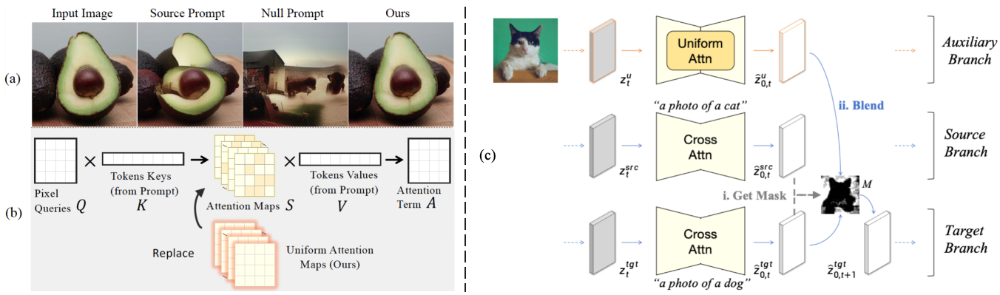

## Uniform Attention Maps


This repository provides the implementation of the paper **"Uniform Attention Maps: Enhancing Image Fidelity in Reconstruction and Editing"** (WACV 2025).

Keywords: Diffusion Model, Image Inversion, Image Editing


##  Method Overview

<details><summary>CLICK for the full abstract</summary>

Text-guided image generation and editing using diffusion models have achieved remarkable advancements. Among these, tuning-free methods have gained attention for their ability to perform edits without extensive model adjustments, offering simplicity and efficiency. However, existing tuning-free approaches often struggle with balancing fidelity and editing precision, particularly due to the influence of cross-attention in DDIM inversion, which introduces reconstruction errors. To address this, we analyze reconstruction from a structural perspective and propose a novel approach that replaces traditional cross-attention with uniform attention maps, significantly enhancing image reconstruction fidelity. Our method effectively minimizes distortions caused by varying text conditions during noise prediction. To complement this improvement, we introduce an adaptive mask-guided editing technique that integrates seamlessly with our reconstruction approach, ensuring consistency and accuracy in editing tasks. Experimental results demonstrate that our approach not only excels in achieving high-fidelity image reconstruction but also performs robustly in real image composition and editing scenarios. This study underscores the potential of uniform attention maps to enhance the fidelity and versatility of diffusion-based image processing methods.
</details>




(a) Image reconstruction using DDIM with different prompts. (b) Our approach introduces Uniform Attention Maps. (c) The proposed tuning-free image editing framework. 


## Getting Started

### Environment Requirement 
```shell
conda create -n masa python=3.9 -y
conda activate masa
conda install pytorch==1.12.1 torchvision==0.13.1 torchaudio==0.12.1 cudatoolkit=11.3 -c pytorch
pip install -r environment/masactrl_requirements.txt
```

### Benchmark Download
You can download the benchmark PIE-Bench (Prompt-driven Image Editing Benchmark) [here](https://forms.gle/hVMkTABb4uvZVjme9).


### Inference 


```shell
python run_editing_masactrl.py --edit_category_list 0 1 2 3 4 5 6 7 8 9 --output_path output --edit_method_list "ddim+masactrl" --guidance_list 7.5 --quantile_list 0.5 --recon_t_list 200 
```

### Evaluation 

```shell
python evaluation/eval.py --metrics "structure_distance" "psnr_unedit_part" "lpips_unedit_part" "mse_unedit_part" "ssim_unedit_part" "clip_similarity_source_image" "clip_similarity_target_image" "clip_similarity_target_image_edit_part" --edit_category_list 0 1 2 3 4 5 6 7 8 9 --tgt_methods 1_ddim+masactrl --output_path output
```


###  Results


Based on our algorithm, as shown in the pseudocode, adding the [red-highlighted line  of code](https://github.com/Mowenyii/Uniform-Attention-Maps/blob/main/models/masactrl/diffuser_utils.py#L248) can significantly improve the editing effect. The quantitative results are shown in the table below, with the red-colored "+ ours" indicating the improvements.


Quantitative comparison of image editing on the PIE benchmark. The methods are compared using the [Masactrl attention control](https://github.com/TencentARC/MasaCtrl).


<!-- ###  Cite Us -->


###  Acknowledgement

Our code is heavily based on the [prompt-to-prompt](https://github.com/google/prompt-to-prompt), [PnPInversion](https://github.com/cure-lab/PnPInversion), [MasaCtrl](https://github.com/TencentARC/MasaCtrl), [pix2pix-zero](https://github.com/pix2pixzero/pix2pix-zero) , [Plug-and-Play](https://github.com/MichalGeyer/plug-and-play), thanks to all the contributors!

